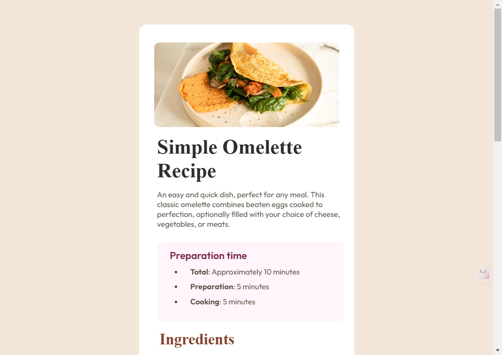

# Frontend Mentor - Recipe page solution

This is a solution to the [Recipe page challenge on Frontend Mentor](https://www.frontendmentor.io/challenges/recipe-page-KiTsR8QQKm). Frontend Mentor challenges help you improve your coding skills by building realistic projects. 

## Table of contents

- [Overview](#overview)
  - [The challenge](#the-challenge)
  - [Screenshot](#screenshot)
  - [Links](#links)
- [My process](#my-process)
  - [Built with](#built-with)
  - [What I learned](#what-i-learned)
  - [Continued development](#continued-development)
- [Author](#author)
- [Acknowledgments](#acknowledgments)

## Overview

## The Challenge

The challenge is to replicate a Simple Recipe Page. This project is to be built using simple HTML and CSS.

### Screenshot

### Links

- Solution URL: [Add solution URL here](https://your-solution-url.com)
- Live Site URL: [Add live site URL here](https://your-live-site-url.com)

## My process

### Built with

- Semantic HTML5 markup
- CSS custom properties

### What I learned

This is the first project of my life. I have learnt to use the theoretical knowledge practically, particularly talking - There's a thing called 'container' for each content. We create a container and then enter the content into it, the reason of creating a container is to manipulate the content according to our need, and to only manipulate the certain part of the viewport (i.e. The Container), and not the whole viewport.

### Continued development

I am currently in the memorizing phase (not the typical memorizing technique, but the creating a muscle memory). I am not totally aware about most of the CSS properties like 'display' (and some properties related to it), difference between 'align-item' and 'justify-content'.

## Author

- Website - [Amit Waghmare](https://www.your-site.com)
- Frontend Mentor - [@waghmare-amit](https://www.frontendmentor.io/profile/waghmare-amit)
- Twitter - [@waghmareamit24](https://www.twitter.com/waghmareamit24)
- LinkedIn - [Amit Waghmare](https://www.linkedin.com/in/amit-waghmare)

## Acknowledgments

For completing this project, I took alot of help from the internet. I just searched a solution for my problem on the internet and used the effective ones, this is how I completed this project in around 4 days. I would like to thank my good friend "Pankaj Ram Pawar", even you'all can ask him for help, this is his LinkedIn - (https://www.linkedin.com/in/pankaj-ram-pawar).
